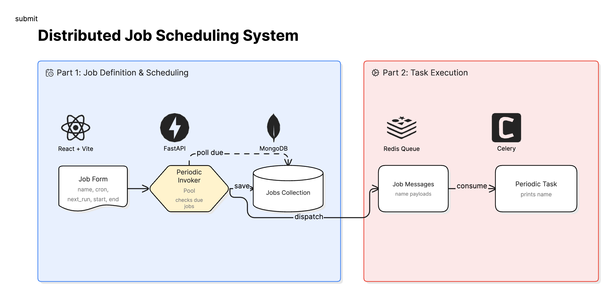
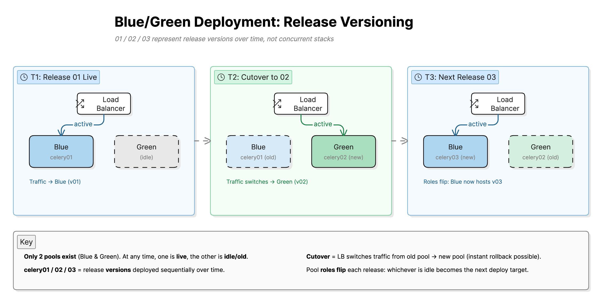

# Data Scheduler Anatomy

### A runnable, readable breakdown of how data jobs get scheduled — from cron expression to worker execution

Every data platform has a scheduler at its core, and most of them are too large to read. This one is deliberately small: the whole path from *"a job is due"* to *"a worker ran it"* is under 400 lines across seven files.

It splits that path into the three layers every real scheduler has — **definition**, **scheduling**, and **execution** — and runs them as separate processes, so you can kill one and watch what the others do.

---
## What You'll Actually See

- **The queue is just a Redis list.** No abstraction to see through — `RPUSH` on one side, `LPOP` on the other. Watch jobs move with `redis-cli LLEN` while the system runs.

- **Scheduling is decoupled from execution.** The FastAPI loop decides *when*; it never runs anything. Stop the workers and jobs pile up in Redis instead of vanishing.

- **Zero-downtime deploys, demonstrated.** Two Celery worker pools (blue/green) consume the same queue. Bring up the new one, drain the old, no job dropped. Most demos skip this entirely.

- **Where it stops — on purpose.** The scheduler runs as a single instance with no distributed lock, so the find-then-update in [`scheduler_service.py`](backend/scheduler_service.py) will double-fire if you run two. That's the exact seam where production schedulers add leader election, and it's easier to understand here, where you can see the race.

---

## Architecture Overview

### System Design



The system is designed with clear separation of concerns:

- **Definition Layer** → user submits jobs via UI  
- **Scheduling Layer** → determines *when* jobs should run  
- **Execution Layer** → performs the actual work  

This separation enables independent scaling and better fault isolation.

---

### 🔁 Blue / Green Deployment Strategy



To support **zero-downtime deployments**, Celery workers are organized into **Blue/Green pools**:

- Only **one pool is active** at a time  
- New releases are deployed to the **idle pool**  
- Traffic switches via Redis queue consumption  
- Old workers are drained and safely terminated  

✔ Zero downtime  
✔ Safe rollback  
✔ Production-ready deployment pattern  
---

## Tech Stack

- React + Vite — UI for job creation  
- FastAPI — API + scheduling engine  
- MongoDB — persistent job definitions  
- Redis — lightweight job queue  
- Celery — distributed task execution  

---

## ⚙️ How It Works (Data Flow)

```text
Browser (React Form)
  → FastAPI saves schedule → MongoDB
       ↓
FastAPI Scheduler (every ~30s)
  → Finds "active + due" jobs
  → Pushes JSON payload → Redis queue
  → Updates next_run in MongoDB
       ↓
Celery Beat (every ~10s)
  → Triggers queue draining
       ↓
Celery Workers
  → LPOP from Redis queue
  → Execute job (process_schedule_job)
```

---

## Run MongoDB + Redis

From this folder:

```bash
docker compose up -d
```

Starts **MongoDB** and **Redis**. API and UI usually run on your machine.

### Celery in Docker (optional)

- **`celery`** profile — beat + **green** workers (day-to-day pool).
- **`celery-blue`** profile — optional **blue** pool during a deploy cutover.

```bash
docker compose --profile celery up -d
docker compose --profile celery --profile celery-blue up -d   # optional second pool
```

Retire blue after tasks drain (graceful stop):

```bash
docker compose stop -t 120 celery-worker-blue
```

**Blue / green:** Two worker pools, **same** Redis and **same** tasks. Steady state = green only. Briefly run blue + green when switching releases; then stop blue. Only **one** `celery-beat`. Image tags / `APP_RELEASE_*` in `.env` next to `docker-compose.yml` — see `.env.example`.

**Host-only Celery** (no Docker): from `backend/` — `celery -A celery_app worker` and `celery -A celery_app beat`. Containers use `redis://redis:6379`; local Uvicorn uses `localhost` in `backend/.env`.

### Tests (Celery drain)

```bash
cd backend && source venv/bin/activate && python -m pytest tests/ -v
```

Mocks Redis; uses Celery eager mode (no broker).

### Watch the pipeline

1. **Uvicorn** — `Enqueued N due schedule(s) to Redis`
2. **Worker** — `[Celery] process_schedule_job name='…'`
3. **Redis** — `docker compose exec redis redis-cli LLEN full_stack:due_jobs`
4. **Beat** — `docker compose logs -f celery-beat`

---

## Run API

```bash
cd backend
python3 -m venv venv
source venv/bin/activate
pip install -r requirements.txt
cp ../.env.example .env
uvicorn main:app --reload --host 127.0.0.1 --port 8000
```

## Run React UI

```bash
cd frontend
npm install
npm run dev
```

Open **http://localhost:5173** and submit the form.

Health check: **http://127.0.0.1:8000/api/health** · Redis list: `redis-cli LRANGE full_stack:due_jobs 0 -1`
